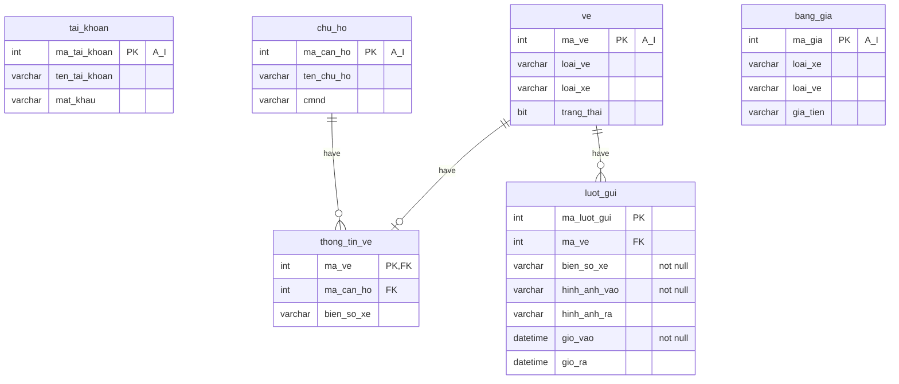

# ENV#
Coppy file EnvConstExample thành EnvConst -> sửa các cấu hình cần thết <br>
# Lưu ý #: 
Nếu không dùng SQL log thì đặt thành false nếu dùng cấu hình lại path cho đúng


# Nếu dùng theo base #
- Từ view khi muốn gọi model phải required_one file autoload trước

- Chú ý file sql 

**Model**

***Insert***: attributes = [
    'a' => 1,
    'b' => 2
]

Insert bản ghi xong -> trả về bản ghi vừa tạo;
Update -> tườn tự trả về bản ghi vừa update

-Câu query tương ứng: INSERT INTO table(a,b) VALUES(1,2) 

Model ->
pdo->query($sql) -> thực hiện câu query và trả về mảng 
pdo->queryAndReturnId -> trả về id của bản ghi vừa được thêm - thường dùng cho insert để lấy id tạo quan hệ 1-1

Khai báo 1 model -> truyền tên table của bảng muốn model tham chiếu đến

Mỗi query get dữ liệu trả về mảng nếu có 1 bản ghi thì là phần tử 0 của mảng
EG:
```PHP
$VE = 
[
    0 -> [ma_the,ma_can_ho,loai_xe,bien_so],
    1 -> [ma_the,ma_can_ho,loai_xe,bien_so]
]
```
 

# ***Helper***

-Session thì dùng helper

-Các tác vụ vều auth dùng AuthHelper

-Localtion dùng WindowHelper

-Title trang dùng ViewHelper
# biểu đồ cơ sở dữ liệu



## hai câu truy vấn lấy thông tin lượt gửi là tương đương nhau
```SQL

SELECT luot_gui.ma_luot_gui, luot_gui.ma_ve, ve.loai_ve, ve.loai_xe, luot_gui.bien_so_xe, luot_gui.gio_vao, luot_gui.gio_ra, ve.trang_thai FROM ve
            RIGHT JOIN luot_gui
            ON  luot_gui.ma_ve = ve.ma_ve
            LEFT JOIN thong_tin_ve
            ON ve.ma_ve = thong_tin_ve.ma_ve
            LEFT JOIN chu_ho 
            ON chu_ho.ma_can_ho = thong_tin_ve.ma_can_ho;


SELECT luot_gui.ma_luot_gui, luot_gui.ma_ve, ve.loai_ve, ve.loai_xe, luot_gui.bien_so_xe, luot_gui.gio_vao, luot_gui.gio_ra
FROM luot_gui
	LEFT JOIN ve
    	ON  luot_gui.ma_ve = ve.ma_ve
    LEFT JOIN thong_tin_ve
    ON ve.ma_ve = thong_tin_ve.ma_ve
            LEFT JOIN chu_ho 
            ON chu_ho.ma_can_ho = thong_tin_ve.ma_can_ho;
```
